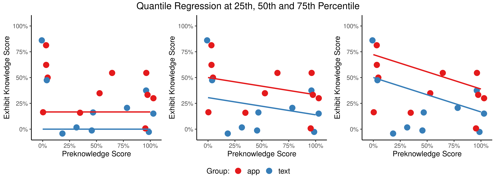

# Projective AR in a Museum
## Evaluation of an Interactive Painting Application

This repository contains R code used to evaluate an [interactive museum application](https://github.com/timkaiser/Paintique), as well as the applied surveys and the data gathered during the evaluation.
The analysis features Quantile Regression and Generalized Additive Models, as well as Bootstrapping next to traditional statistical testing.

Some featured results (more can be found in the plots folder):

  

  
  

