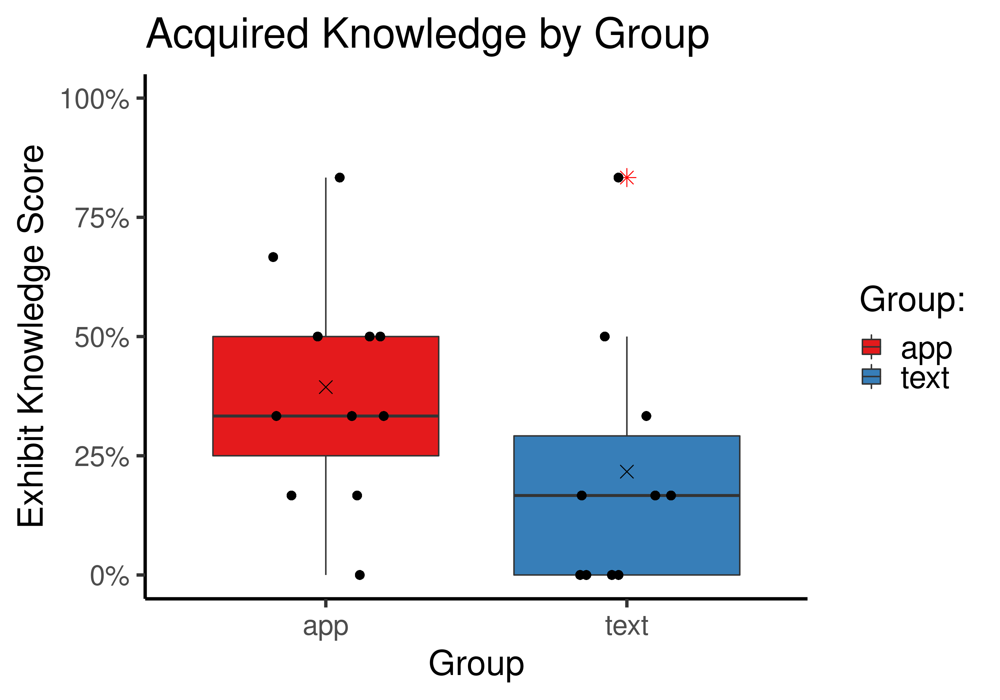
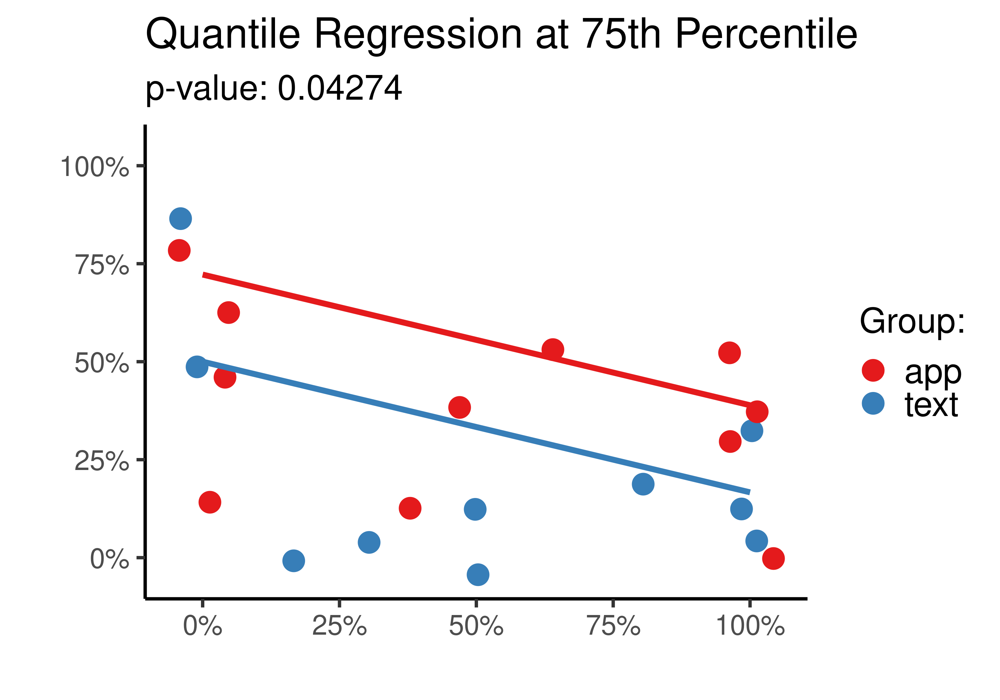
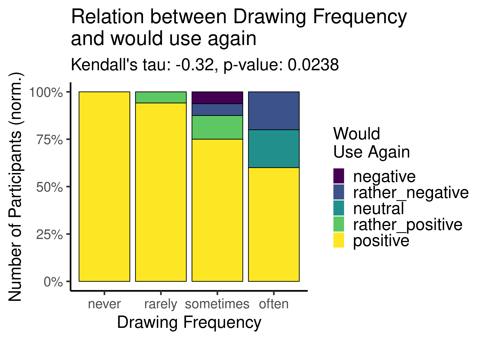

# Projective AR in a Museum
## Evaluation of an Interactive Painting Application

This repository contains R code used to evaluate an [interactive museum application](https://github.com/timkaiser/Paintique), as well as the applied surveys and the data gathered during the evaluation. In total two studies were conducted to evaluate the application. The first user study assessed the prototype, whereas the second focused on the impact of the application on knowledge transfer in comparison to traditional exhibition methods.
The analysis features Quantile Regression and Generalized Additive Models, as well as Bootstrapping next to traditional statistical testing. Most plots were produced using the library ggplot2.

## Featured results 
(more can be found in the plots folder)

### Comparative Study on Knowledge Transfer

  
  

  
  

### User Study on the Prototype

  
  

  
  

  

